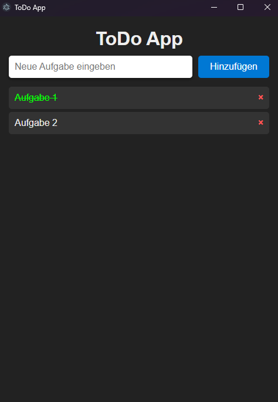

# 📝 ToDo-App

Eine moderne ToDo-App gebaut mit **Electron**.  
Einfache Bedienung, dunkles Design und klar strukturierte Aufgabenverwaltung.



---

## ✔️ Features

- ✔️ Aufgaben hinzufügen  
- ✔️ Aufgaben als erledigt markieren (grün + durchgestrichen)  
- ✔️ Aufgaben einzeln löschen   
- ✔️ Lässt sich als EXE bauen (Windows)

---

## ❌ Noch nicht funktionierende Features

- ❌ **Dauerhaftes Speichern der Aufgaben funktioniert aktuell NICHT**  
  Beim Neustarten der App werden alle Aufgaben **noch nicht geladen**.  
  (Wird in einer zukünftigen Version behoben.)

---

## 📦 Installation

### 1. Repository klonen

```bash
git clone https://github.com/deinusername/todo-app.git
cd todo-app
